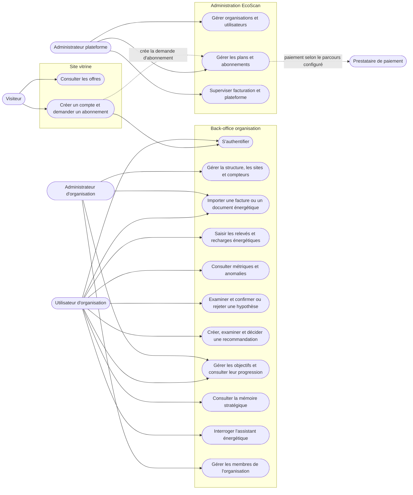

# Cas d'utilisation EcoScan

Le diagramme distingue la validation humaine d'une hypothèse de la décision
d'adopter une recommandation. La mesure Woyofal du rituel s'applique uniquement
aux relevés disponibles entre 08 h et 20 h.
