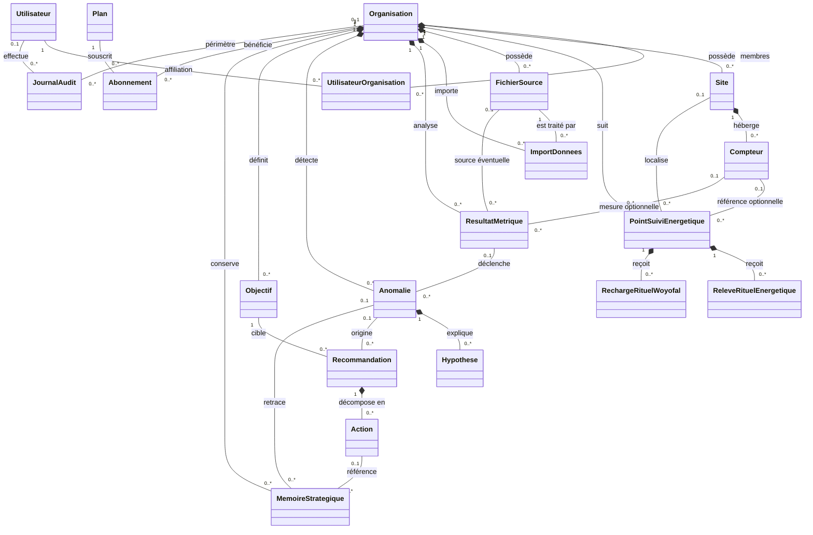

# Classes métier et relations

Vue simplifiée des principales classes persistées et de leurs associations.
Les détails de rôles, statuts et champs secondaires sont volontairement omis.

`PointSuiviEnergetique` représente le suivi rituel et peut être rattaché à un
compteur physique ou fonctionner sans compteur. Les résultats agrégés du rituel
Woyofal sont au niveau de l'organisation ; les périodes couvertes sont 08 h–20 h.
La mémoire stratégique conserve les diagnostics et actions validés, pas les
relevés bruts.
