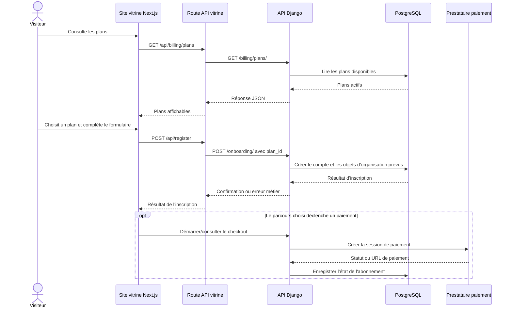
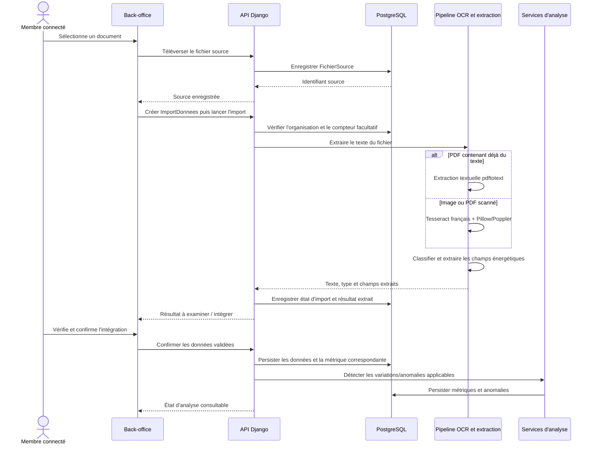
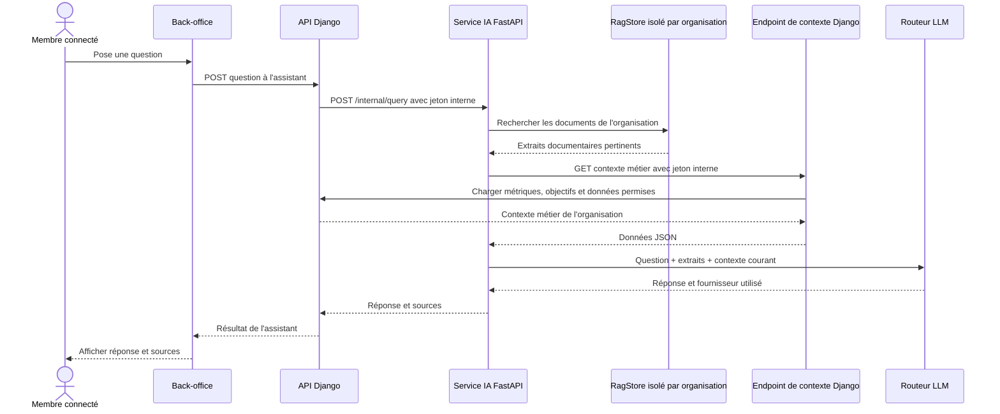
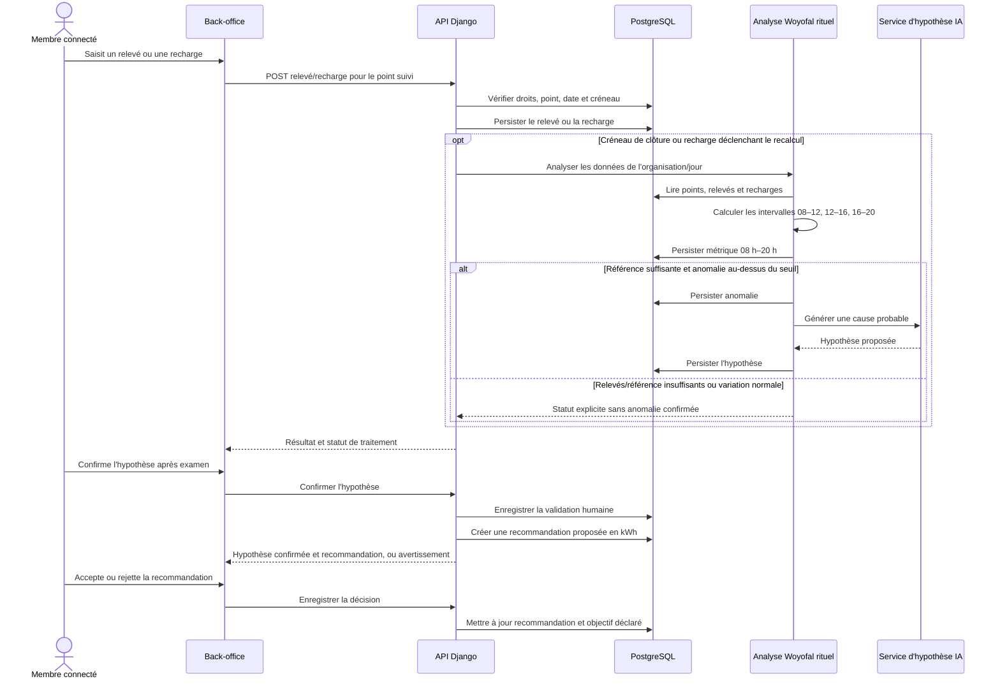

# Séquences principales

## Inscription depuis la vitrine et demande d'abonnement

Le prestataire intervient selon le parcours de facturation réellement configuré ;
la sélection d'un plan ne doit pas être confondue avec un paiement confirmé.

## Import d'une facture et intégration analytique

Le contrôle humain précède l'intégration quand le pipeline demande une revue ;
un document rejeté ou incomplet n'est pas présenté comme une mesure fiable.

## Assistant RAG avec contexte métier

## Relevés rituels Woyofal et chaîne de décision

La mesure Woyofal rituelle est une fenêtre observée de 08 h à 20 h, pas une
estimation de la consommation sur 24 heures. Une anomalie ne prouve jamais sa
cause ; la validation d'une hypothèse et la décision d'adopter une
recommandation sont des gestes humains distincts.
